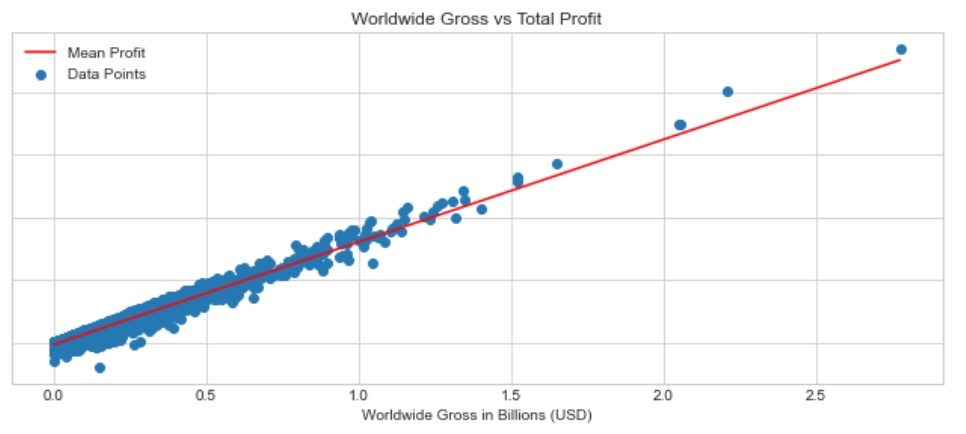

# Movie Studio Production Analysis

## Overview 

This project analyzes multiple datasets regarding movie information, key figures associated with those movies, and total budget and financial returns. The analysis undertaken shows the various factors that play a role in movie success measured by profit, including particular genres, directors, and principal actors. A business can use this data to take the best approach for producing the most profitable movies.

## Business Problem

Your company now sees all the big companies creating original video content and they want to get in on the fun. They have decided to create a new movie studio, but they don’t know anything about creating movies. You are charged with exploring what types of films are currently doing the best at the box office. You must then translate those findings into actionable insights that the head of your company's new movie studio can use to help decide what type of films to create.

## Data 

There were two datasets in particular that were used for this analysis. One dataset, called 'tn.movie_budgets.csv', contains a sample of over five thousand movies and their respective production budget, domestic gross, and worldwide gross. The other dataset, called 'im.db', is a SQL database containing a large dataset from IMDB, a database about movies. The key tables used contained information about a movie's name, genre, and release date, as well as principal actors and directors associated with that movie.

## Methods

This project uses descriptive analysis, including analysis of most profitable movies over the period of 1980 - present day, as well as the most profitable principal actors, directors, and genres, measured in accordance with the highest net profitable movies. This project additionally uses linear analysis to test relationships between factors like worldwide gross, production budget, and number of profitable directors and principal actors associated with a movie/genre against the total profit. This provides key insights to optimizing the methodology towards producing movies.

## Results

There is a strong relationship between worldwide gross and total profit, but not between production budget and total profit. 



There are specific actors and directors that reliably produce top profits.


The action/adventure/sci-fi genre is most associated with these names and is the most profitable genre.


## Conclusions

The conducted analysis leads to three recommendations for movie production:

* **Focus on Action/Adventure/Sci-Fi.** This seems to be all the rage at the box office right now, as our analysis indicated this was the most profitable genre and involves the most profitable actors/directors. 

* **Certain Actors and Directors are Reliable Money-Makers.** Actors like Chris Evans, as well as directors like the Russo Brothers, seem to frequently strike gold at the box office. It would only make sense to seek them out for projects. 

* **Don't Focus So Much On Budget and Aim for International Release.** While you may think that a higher production budget inevitably results in higher profits, this has been demonstrated to not necessarily be the case, as there have been plenty of flops over the years. Regardless of the budget, the worldwide gross will dictate the amount of profit the movie ultimately generates. 

## For More Information

See the full analysis in the [Jupyter Notebook](./notebook.ipynb) or review this [presentation](./Presentation.pdf).

See the dataset used by clicking [here](./movie_data/).

## Repository Structure

```
├── images
├── movie_data
├── README.md
├── notebook.ipynb
└── presentation.pdf
```
